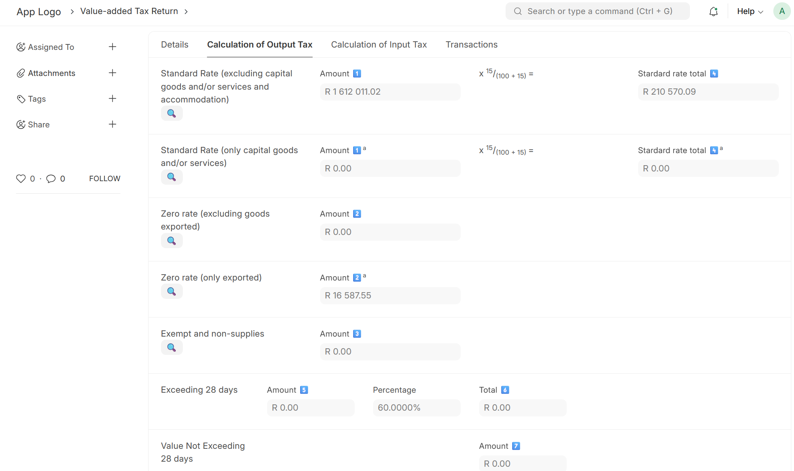

<div align="center" markdown="1">


# South Africa Customisations

**South Africa Customisations**

</div>


### South Africa Customisations


[](https://codecov.io/github/Starktail/csf_za)

Country Specific Functionality for South Africa

This is a Frappe app, intended to be used with ERPNext (version 15).

### Features

1. Value-added Tax Return: This makes submitting your VAT201 returns to SARS much easier
2. Support for Bank Statements from South African Banks: Native import of .csv formats from FNB, ABSA and Bank Zero
3. Easy-add of VAT in Bank Reconciliation Tool: No need to Edit in Full Page for those Journal Entries that require a VAT leg

### License

MIT

### User documentation

📄 [South Africa Customisations Documentation](https://csf-za-docs.starktail.com/csf_za_introduction)

### Installation

You can install this app using the [bench](https://github.com/frappe/bench) CLI:

```bash
cd $PATH_TO_YOUR_BENCH
bench get-app $URL_OF_THIS_REPO --branch develop
bench install-app csf_za
```

### Development

#### Tests

To run unit tests:

```shell
bench --site test_site run-tests --app csf_za --coverage
```

To run UI/integration tests:

The following depencies are required
```shell
sudo apt update
# Dependencies for cypress: https://docs.cypress.io/guides/continuous-integration/introduction#UbuntuDebian
sudo apt-get install libgtk2.0-0 libgtk-3-0 libgbm-dev libnotify-dev libgconf-2-4 libnss3 libxss1 libasound2 libxtst6 xauth xvfb

sudo apt-get install chromium
```

```shell
bench --site test_site run-ui-tests csf_za --headless --browser chromium
```

#### Contributing

This app uses `pre-commit` for code formatting and linting. Please [install pre-commit](https://pre-commit.com/#installation) and enable it for this repository:

```bash
cd apps/csf_za
pre-commit install

#(optional) Run against all the files
pre-commit run --all-files
```

Pre-commit is configured to use the following tools for checking and formatting your code:

- ruff
- eslint
- prettier
- pyupgrade


We use [Semgrep](https://semgrep.dev/docs/getting-started/) rules specific to [Frappe Framework](https://github.com/frappe/frappe)
```shell
# Install semgrep
python3 -m pip install semgrep

# Clone the rules repository
git clone --depth 1 https://github.com/frappe/semgrep-rules.git frappe-semgrep-rules

# Run semgrep specifying rules folder as config 
semgrep --config=/workspace/development/frappe-semgrep-rules/rules apps/csf_za
```

#### Updating Documentation

For documentation, we use [vitepress](https://vitepress.dev/). You can run `yarn docs:dev` to preview the docs when applying changes

#### CI

This app can use GitHub Actions for CI. The following workflows are configured:

- CI: Installs this app and runs unit tests on every push to `develop` branch.
- Linters: Runs [Frappe Semgrep Rules](https://github.com/frappe/semgrep-rules) and [pip-audit](https://pypi.org/project/pip-audit/) on every pull request, as well as [Semgrep](https://semgrep.dev/docs/getting-started/)

