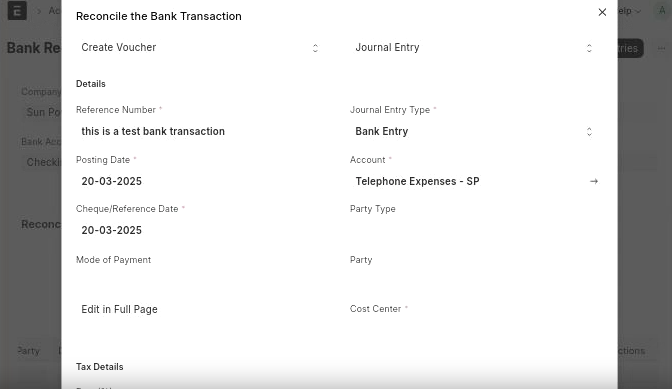
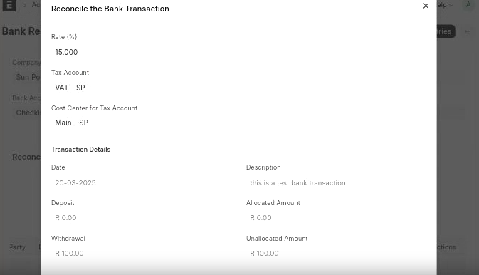

# Easy VAT Addition in Bank Reconciliation Tool

This feature enhances the Bank Reconciliation Tool to simplify the process of accounting for Value-Added Tax (VAT) when creating Journal Entries for bank transactions. It allows for automatic calculation and posting of VAT, saving time and reducing manual errors.

## Setup

To use this feature, you first need to configure the relevant expense accounts. For each **Account** that will be used for taxable transactions during bank reconciliation, you need to set default VAT details.

1.  Navigate to the **Chart of Accounts**.
2.  Select the expense account you want to configure (e.g., "Telephone Expenses").
3.  In the Account settings, locate the **Bank Reconciliation** section.
4.  Fill in the following fields:

*   **Tax Account**: Specify the VAT account to which the tax portion of the transaction should be posted (e.g., "VAT").
*   **Tax Rate**: Enter the applicable VAT percentage (e.g., 15 for 15%).
*   **Cost Center for Tax Account** (Optional): If the VAT portion of the Journal Entry needs to be allocated to a specific Cost Center, select it here.

## Bank Reconciliation Process

Once the accounts are set up, the process in the Bank Reconciliation Tool is streamlined.

1.  Open the **Bank Reconciliation Tool** and load your bank transactions.
2.  For a given bank transaction, click on **Create Voucher**.

    

3.  In the dialog, set the **Document Type** to **Journal Entry**. A **Tax Details** section will appear.
4.  Select the appropriate expense **Account** in the **Second Account** field.

    

5.  Upon selecting the account, the system will automatically fetch the **Tax Account**, **Tax Rate**, and **Cost Center for Tax Account** from the values you configured on the expense account master.

When you create the Journal Entry, the system will automatically split the transaction amount. The main expense portion will be posted to the selected expense account, and the calculated VAT amount will be posted to the specified Tax Account, creating a three-line journal entry (Bank, Expense, and VAT). This ensures that VAT is correctly accounted for directly from the bank reconciliation screen.
