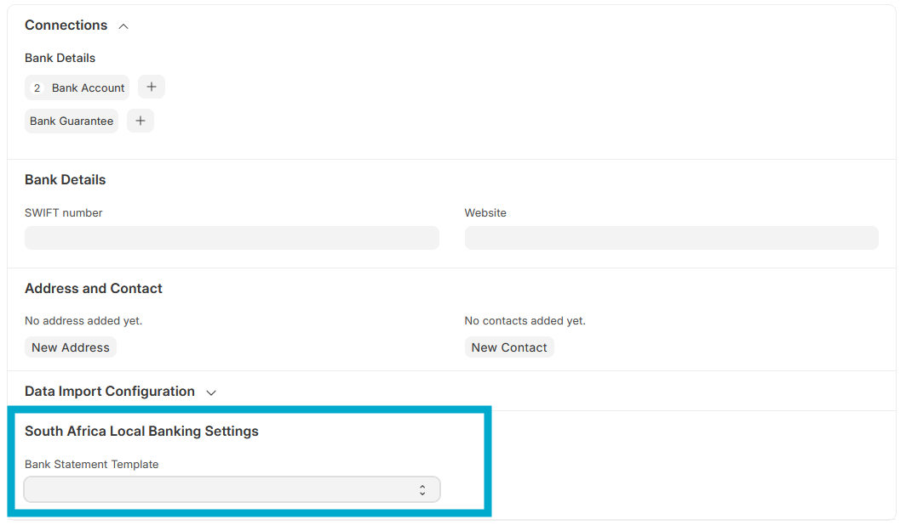

# Bank Statement Import for South African Banks

This feature simplifies the process of importing bank statements by allowing you to directly upload CSV files from major South African banks without needing to manually reformat them. The system automatically parses the bank-specific file format and converts it into a standardized structure that ERPNext can use for reconciliation.

Currently, the following banks are supported:
- First National Bank
- Bank Zero
- Capitec
- Nedbank
- Standard Bank
- ABSA

## Setup

To enable the automatic parsing, you must configure the relevant **Bank** record in your system.

1.  Navigate to the **Bank** list (you can search for "Bank" in the Awesome Bar).
2.  Select the bank you want to configure (e.g., "First National Bank").
3.  In the **Bank Statement Template** field, choose the corresponding bank name from the dropdown list.

## Bank Statement Import Process

Once the setup is complete, importing a bank statement is straightforward.

1.  Navigate to the **Bank Statement Import** doctype and create a new record.
2.  Select the **Bank Account** for which you are importing the statement. The system will use the **Bank** linked to this account to determine which template to use.
3.  Upload the original CSV file you downloaded from your bank in the **Attach File** field.
4.  Upon saving the document, the system performs the following actions in the background:
    *   It reads the uploaded CSV file.
    *   Based on the template selected on the **Bank** record, it parses the bank-specific columns and data.
    *   It creates a new, standardized CSV file with the columns required by ERPNext (e.g., splitting a single "Amount" column into "Deposit" and "Withdrawal").
    *   This new file is then attached to the document and used for the bank reconciliation process, making the import seamless for the user.

## Supported Formats

The following tables show the specific CSV formats that the system is configured to parse for each bank.

### First National Bank

|     | A                             | B           | C      | D                      | E                      | F        | G             | H   |
| --- | ----------------------------- | ----------- | ------ | ---------------------- | ---------------------- | -------- | ------------- | --- |
| 1   | ACCOUNT TRANSACTION HISTORY   |             |        |                        |                        |          |               |     |
| 2   | FOR ACCOUNT NUMBER 1234567890 |             |        |                        |                        |          |               |     |
| 3   | Date                          | SERVICE FEE | Amount | DESCRIPTION            | REFERENCE              | Balance  | CHEQUE NUMBER |     |
| 4   | 2025/01/01                    | 0           | 750    | FNB APP PAYMENT FROM X | FNB APP PAYMENT FROM X | -1234567 | 0             |     |
| 5   |                               |             |        |                        |                        |          |               |     |
| 6   |                               |             |        |                        |                        |          |               |     |

### Bank Zero

|     | A    | B   | C    | D    | E             | F             | G   | H      | I       | J               |
| --- | ---- | --- | ---- | ---- | ------------- | ------------- | --- | ------ | ------- | --------------- |
| 1   | Date | Day | Time | Type | Description 1 | Description 2 | Fee | Amount | Balance | Has Attachments |
| 2   |      |     |      |      |               |               |     |        |         |                 |
| 3   |      |     |      |      |               |               |     |        |         |                 |

### Capitec

|    | A                        | B          | C                 | D                                                  | E        | F      | G         | H |
|----|--------------------------|------------|-------------------|----------------------------------------------------|----------|--------|-----------|---|
| 1  | Balance brought forward: | 122411.10  |                   |                                                    |          |        |           |   |
| 2  |                          |            |                   |                                                    |          |        |           |   |
| 3  | Account                  | Date       | Description       | Reference                                          | Amount   | Fees   | Balance   |   |
| 4  | 1051185815               | 31/03/2025 | Debit Order       | CAPITEC   D000001212                               | -1528.49 | -3.00  | 61799.77  |   |
| 5  | 1051185815               | 31/03/2025 | Inward EFT Credit | COMPANY X                                          | 19599.08 |        | 81398.85  |   |
| 6  | 1051185815               | 31/03/2025 | Inward EFT Credit | CASHFOCUS COMPANY Y                                | 920.77   |        | 82319.62  |   |
| 7  | 1051185815               | 31/03/2025 | Inward EFT Credit | CI123456                                           | 78037.40 |        | 160357.02 |   |
| 8  | 1051185815               | 31/03/2025 | Month S/Fee       |                                                    |          | -50.00 | 160307.02 |   |
| 9  | 1051185815               | 31/03/2025 | Notify Fee        |                                                    |          | -29.40 | 160277.62 |   |
| 10 | Total:                   |            |                   |                                                    | 38063.92 | -197.4 | 160277.62 |   |

### Nedbank

|    | A                     | B                         | C       | D        | E |
|----|-----------------------|---------------------------|---------|----------|---|
| 1  | Statement Enquiry :   |                           |         |          |   |
| 2  | Account Number :      | 1234567891                |         |          |   |
| 3  | Account Description : | CURRENT                   |         |          |   |
| 4  | Statement Number :    | 3000                      |         |          |   |
| 5  | 01Mar2025             | ROADCOVER 250301          | -33     | 54676.77 |   |
| 6  | 03Mar2025             | loan                      | -1000   | 53676.77 |   |
| 7  | 27Mar2025             | VAT 25/02-26/03 = R15.22  |         | 11373.78 |   |
| 8  | 27Mar2025             | SERVICE FEE 25/02 - 26/03 | -41.6   | 11332.18 |   |
| 9  | 27Mar2025             | MAINTENANCE FEE           | -75     | 11257.18 |   |
| 10 | 27Mar2025             | CARRIED FORWARD           |         | 11257.18 |   |
| 11 | 27Mar2025             | BROUGHT FORWARD           |         | 11257.18 |   |
| 12 | 27Mar2025             | PROVISIONAL STATEMENT     |         |          |   |
| 13 | 31Mar2025             | CASHFOCUS DIV             | 9106.98 | 20364.16 |   |

### Standard Bank

|    | A                    | B                        | C                | D                                                                 | E         | F          | G    | H                              | I                  | J |
|----|----------------------|--------------------------|------------------|-------------------------------------------------------------------|-----------|------------|------|--------------------------------|--------------------|---|
| 1  | Statement of Account |                          |                  |                                                                   |           |            |      |                                |                    |   |
| 2  |                      |                          |                  |                                                                   |           |            |      |                                |                    |   |
| 3  | Account Name:        | MY COMPANY PTY LTD       |                  |                                                                   |           |            |      |                                |                    |   |
| 4  |                      |                          |                  |                                                                   |           |            |      |                                |                    |   |
| 5  | Account No:          | 12345678 - SBZAZAJJ      |                  |                                                                   |           |            |      |                                |                    |   |
| 6  |                      |                          |                  |                                                                   |           |            |      |                                |                    |   |
| 7  | A/C Type:            | ORD CURRENT ACCOUNT      |                  |                                                                   |           |            |      |                                |                    |   |
| 8  |                      |                          |                  |                                                                   |           |            |      |                                |                    |   |
| 9  | BIC Code:            | SBZAZAJJ                 |                  |                                                                   |           |            |      |                                |                    |   |
| 10 |                      |                          |                  |                                                                   |           |            |      |                                |                    |   |
| 11 | Bank Name:           | STANDARD BANK OF SA LTD  |                  |                                                                   |           |            |      |                                |                    |   |
| 12 |                      |                          |                  |                                                                   |           |            |      |                                |                    |   |
| 13 | Currency:            | ZAR - SOUTH AFRICAN RAND |                  |                                                                   |           |            |      |                                |                    |   |
| 14 |                      |                          |                  |                                                                   |           |            |      |                                |                    |   |
| 15 | Date                 | Value Date               | Statement Number | Description                                                       | Amount    | Balance    | Type | Originator Reference           | Customer Reference |   |
| 16 | 2025/02/04           | 2025/02/04               | 0249             | OPEN BALANCE 0402 000000000000000                                 |           | +509910.25 |      | OPEN BALANCE                   |                    |   |
| 17 | 2025/04/02           | 2025/04/02               | 0250             | IB PAYMENT TO ABSA HOME 12345678 ABSA HOME 2 0204 000000000000111 | -7000.00  | +138985.31 | TRF  | ABSA HOME 12345678 ABSA HOME 2 |                    |   |
| 18 | 2025/04/02           | 2025/04/02               | 0250             | ELECTRONIC BANKING PAYMENT TO 12345 REFERENCE 01 000000000000509  | -22046.86 | +116938.45 | TRF  | REFERENCE 01                   |                    |   |
| 19 | 2025/04/02           | 2025/04/02               | 0250             | ELECTRONIC BANKING PAYMENT TO 12345 REFERENCE 01 000000000000509  | -35448.75 | +81489.70  | TRF  | REFERENCE 01                   |                    |   |
| 20 | 2025/04/02           | 2025/04/02               | 0250             | IB PAYMENT TO SB FLEET MAN 0204 000000000000111                   | -35826.69 | +45663.01  | TRF  | SB FLEET MAN                   |                    |   |
| 21 | 2025/04/02           | 2025/04/02               | 0250             | CLOSE BALANCE 0204 000000000000000                                |           | +45663.01  | TRF  | CLOSE BALANCE                  |                    |   |

### ABSA

|     | A        | B                  | C      | D       |
| --- | -------- | ------------------ | ------ | ------- |
| 1   | Date     | Description        | Amount | Balance |
| 2   | 20250120 | DIGITAL PAYMENT DT | 100    | 3000    |
| 3   |          |                    |        |         |
