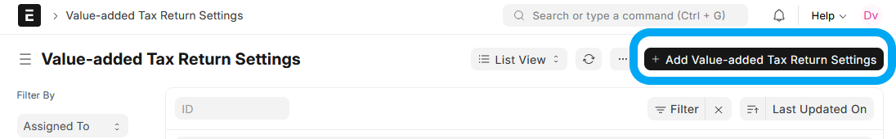
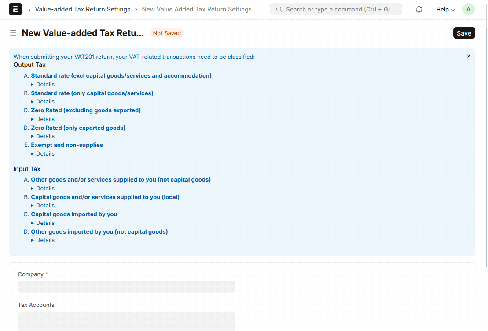

# Value-added Tax Return

## Background

[Value-Added Tax (VAT)](https://www.sars.gov.za/types-of-tax/value-added-tax/) is an indirect tax on the consumption of goods and services. VAT-registered businesses (vendors) must periodically submit a VAT 201 declaration to the South African Revenue Service (SARS).

The **Value-added Tax Return** feature in this application is designed to streamline this process. It automatically fetches all VAT-related transactions within a specified period, classifies them according to the official VAT 201 categories, and presents them in a format that mirrors the SARS return, making it easy to review, verify, and file.

## 1. Setup

Before you can create a VAT Return, you need to configure the system to correctly identify and classify your VAT transactions. This is a one-time setup.

### 1.1. Value-added Tax Return Settings

First, create a **Value-added Tax Return Settings** document for each Company in your system.

1.  In the Awesome Bar, search for "Value-added Tax Return Settings" and go to the list view.
2.  Click **Add Value-added Tax Return Settings**.
3.  Select the **Company** these settings will apply to.

4.  **Tax Accounts**: In this table, add all the G/L accounts that you use for VAT processing. These are typically your VAT control accounts. The system will fetch all transactions from these accounts when generating a return. You can click the "auto_set_tax_accounts" button to automatically populate this table with all accounts of type "Tax".
5.  **Map Classifications**: This is the most critical step for automating your VAT return. Here, you will map your existing **Taxes and Charges Templates** to the official SARS VAT classifications.
    *   For each **Output Tax** category (e.g., "Standard rate (excl capital goods)"), select the corresponding **Sales Taxes and Charges Template** you use for such sales.
    *   For each **Input Tax** category, select the corresponding **Purchase Taxes and Charges Template**.

    This mapping allows the system to automatically classify any transaction originating from a Sales Invoice or Purchase Invoice.

### 1.2. Account Settings for Manual Journal Entries

Transactions from Sales and Purchase Invoices are classified using the settings above. However, for manual Journal Entries (e.g., bank charges, fuel expenses, write-offs), the system uses settings on the individual G/L accounts to determine the classification.

For each relevant expense or income account, you need to set the default VAT classification:

1.  Navigate to the **Chart of Accounts** and select an account (e.g., "Bank Charges").
2.  In the account's settings, find the **VAT Return Classification** section.
3.  Set the appropriate classification for debit and credit entries. For an expense account like "Bank Charges," you would typically set the **Classify Debit entries as**: `Input - C Other goods supplied to you (excl capital goods)`.
4.  Save the account. Repeat this for all accounts that you use in manual VAT-related journal entries.

## 2. Creating a VAT Return

Once the setup is complete, you can generate your VAT return.

1.  In the Awesome Bar, search for **Value-added Tax Return** and create a new document.
2.  Set the **Company**, **Tax Period** (in CCYYMM format, e.g., 202508), and the **Date From** and **Date To** for the return period.
3.  Save the document.

### 2.1. Fetching Transactions

Click the **Get transactions for period** button. The system will:
*   Fetch all GL entries from your specified **Tax Accounts** within the date range.
*   Fetch related Sales Invoices and Purchase Invoices to find zero-rated transactions.
*   Attempt to classify each transaction based on the setup you completed.
*   Populate the **Transactions** table at the bottom of the form with the results.

### 2.2. Classifying and Reviewing Transactions

After fetching, the system will indicate if there are any unclassified transactions.

*   **Automatically Classified**: Transactions from Invoices or well-defined Journal Entries will be classified automatically.
*   **Unclassified**: Some complex or unusual Journal Entries may remain unclassified. You must manually review these.

Go to the **Transactions** tab to review the fetched entries. For any unclassified row, select the correct **Classification** from the dropdown menu.

### 2.3. Reviewing the VAT 201 Form

As you classify transactions, the **Calculation of Output Tax** and **Calculation of Input Tax** tabs are automatically updated. These tabs are structured to look exactly like the SARS VAT 201 form, with each field corresponding to a box on the official return.

To verify the amount in any field, click the **magnifying glass icon (🔍)** next to it. This will open the **Value-added Tax Return Linked Transactions** report, pre-filtered to show you exactly which transactions make up that total.

### 2.4. Submitting the Return

Once you have classified all transactions and are satisfied with the totals on the form, you can **Submit** the document. This will lock the return and prevent further changes. You can now use the information on this form to complete your official VAT 201 filing with SARS.