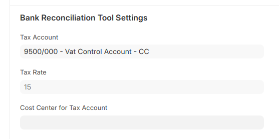

# Easy-add of VAT in Bank Reconciliation Tool

🚧 This documentation is still under construction 🚧
- [x] Create page for feautre
- [ ] Add all steps with screenshots

## Setup

On every **Account** that will have taxable Journal Entries during Bank Reconciliation, complete these fields:

*Tax Account*: The relevant **Account** to where the VAT portion should be posted
*Tax Rate*: The relevant **Account** to where the VAT portion should be posted
*Cost Center for Tax Account* (Optional): If the VAT-leg of the **Journal Entry** should have a **Cost Center** set, set it here.

## Bank Reconcilation

During Bank Reconciliation, when your *Action* is set to *Create Voucher* and you select an Account, the *Tax Account* and *Tax Rate* will be populated, and will be used to add a VAT-leg in the created **Journal Entry**.

