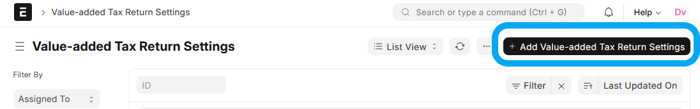
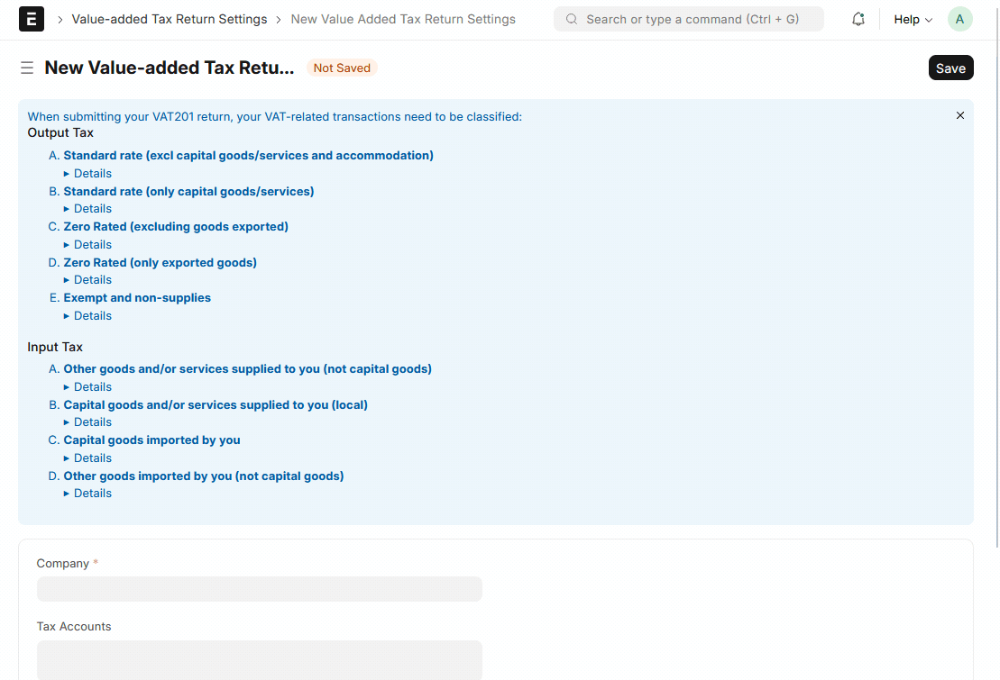

# Value-added Tax Return

🚧 This documentation is still under construction 🚧
- [x] Create page for feautre
- [ ] Add all steps with screenshots

## Background

[Value-Added Tax](https://www.sars.gov.za/types-of-tax/value-added-tax/) is an indirect tax on the consumption of goods and services in the economy. Revenue is raised for government by requiring certain traders (vendors), that carry on an enterprise to register for VAT.

VAT-registered vendors must perform declarations to SARS on a frequent basis, using the VAT 201 form. The *Value-added Tax Return* makes this process easier

## Setup

Before creating VAT Returns, you first have to set up a **Value-added Tax Return Settings** document for each Company.

On **Value-added Tax Return Settings** List, click on **Add Value-added Tax Return Settings**

You'll be greeted with a summary page of how SARS classifies Value-Added Tax. Expand the different sections to see more details.

TBC....